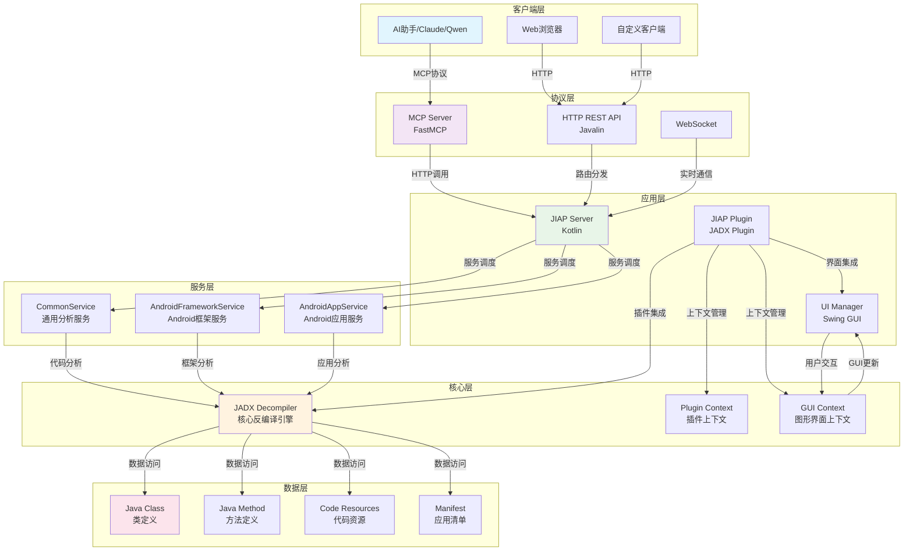

# JIAP - Java智能分析平台

<div align="center">


**基于JADX的Java智能分析平台 - 为AI辅助代码分析而设计**

[📖 文档](#-项目概述) | [🏗️ 架构设计](#-架构设计) | [🚀 快速开始](#-快速开始) | [🛠️ API参考](#-api参考) | [🔧 开发指南](#-开发指南)

</div>

---

## 📖 项目概述

JIAP (Java Intelligence Analysis Platform) 是一个基于JADX反编译器的智能代码分析平台，专门为AI辅助代码分析而设计。该平台通过HTTP API和MCP (Model Context Protocol) 协议，为AI助手提供强大的Java代码分析能力。

### ✨ 核心特性

- 🔍 **基于JADX的代码分析**: 深度Java代码解析和反编译
- 🌐 **REST API**: 提供HTTP接口和MCP协议支持
- 📱 **Android专项**: 应用分析和框架层安全审计
- 🎯 **交叉引用**: 代码引用关系追踪
- 🔄 **GUI集成**: 与JADX界面实时同步
- ⚡ **分页处理**: 支持大规模代码库分析
- 🏃 **Daemon模式**: 支持JADX无GUI后台运行模式
- 🔧 **自定义接口**: 灵活的API扩展机制

### 🎯 应用场景

- **AI辅助代码审计**: 为AI助手提供深度代码分析能力
- **Android安全研究**: 框架层API安全分析和漏洞挖掘
- **恶意软件分析**: Java恶意软件的深度静态分析
- **代码重构优化**: 智能代码结构分析和重构建议
- **学习研究**: Java代码结构学习和教学模式

---

## 🏗️ 架构设计

### 整体架构图



### 技术栈详解

#### 🎨 前端技术
- **Swing GUI**: 基于Java Swing的桌面应用界面
- **JADX GUI**: 集成JADX原生图形界面组件
- **实时同步**: 与JADX GUI的实时状态同步

#### ⚙️ 后端技术
- **Kotlin**: 主要开发语言，类型安全且简洁
- **Javalin**: 轻量级Web框架，提供REST API
- **FastMCP**: MCP协议服务器实现
- **JADX API**: 核心反编译和分析引擎

#### 🗄️ 数据处理
- **智能缓存**: 多级缓存机制，提升响应速度
- **分页处理**: 支持大数据量的分页加载
- **异步处理**: 非阻塞的异步任务处理

### 核心组件设计

#### 1. JIAP Server (HTTP服务器)
```kotlin
class JiapServer(
    private val pluginContext: JadxPluginContext,
    private val scheduler: ScheduledExecutorService
)
```
**职责**:
- HTTP服务器生命周期管理
- API路由配置和请求处理
- 服务健康检查和状态监控
- 延迟初始化和自动重启

#### 2. Service Layer (业务服务层)
```kotlin
interface JiapServiceInterface {
    val pluginContext: JadxPluginContext
    val decompiler get() = pluginContext.decompiler
    val gui: Boolean get() = isGui()
}
```
**设计模式**: 策略模式 + 模板方法模式
**服务分类**:
- **CommonService**: 通用代码分析服务
- **AndroidFrameworkService**: Android框架分析服务
- **AndroidAppService**: Android应用分析服务

#### 3. MCP Server (AI协议层)
```python
class FastMCP("JIAP MCP Server")
```
**核心功能**:
- MCP协议实现
- AI工具集成
- 缓存和分页处理
- 错误处理和重试机制

---

## 🚀 快速开始

### 环境要求

- **Java**: JDK 11+
- **JADX**: 1.5.2 r2472+
- **Python**: 3.8+ (用于MCP Server)
- **内存**: 推荐4GB+

### 安装步骤

#### 1. 编译项目

```bash
# 编译核心插件
cd jiap_core
./gradlew dist

# 安装MCP服务器依赖
cd mcp_server
uv sync
```

#### 2. 安装到JADX

```bash
jadx plugins --install-jar <path-to-jiap.jar>

# 或者直接在JADX中安装
# JADX -> Plugins -> Install from JAR
```

#### 3. 启动方式

##### GUI模式（推荐）
```bash
# 启动JADX GUI，插件自动加载
jadx-gui your-app.apk
```

##### Daemon模式（无GUI后台运行）
```bash
# 使用daemon模式启动，适合服务器环境
jadx -d your-app.apk --export-dir ./output --load-plugins jiap-plugin.jar

# 或者在JADX GUI中启用daemon模式
# Tools -> Preferences -> Plugins -> JIAP -> Enable Daemon Mode
```

#### 4. 启动MCP服务器

```bash
cd mcp_server

# 默认配置启动
python jiap_mcp_server.py

# 自定义JADX服务器地址
python jiap_mcp_server.py --jiap-host 192.168.1.100 --jiap-port 25420

# 使用完整URL
python jiap_mcp_server.py --jiap-url "http://192.168.1.100:25420"

# 使用环境变量
export JIAP_URL="http://192.168.1.100:25420"
python jiap_mcp_server.py
```

---

## 🛠️ API参考

### HTTP API端点

#### 基础代码分析
```http
POST /api/jiap/get_all_classes          # 获取所有类列表
POST /api/jiap/get_class_source         # 获取类源码
POST /api/jiap/search_method            # 搜索方法
POST /api/jiap/get_method_source        # 获取方法源码
POST /api/jiap/get_class_info           # 获取类信息
```

#### 高级分析功能
```http
POST /api/jiap/get_method_xref          # 方法交叉引用
POST /api/jiap/get_class_xref           # 类交叉引用
POST /api/jiap/get_implement            # 接口实现类
POST /api/jiap/get_sub_classes          # 子类查找
```

#### Android专项
```http
POST /api/jiap/get_app_manifest         # 应用清单
POST /api/jiap/get_main_activity        # 主Activity
POST /api/jiap/get_system_service_impl  # 系统服务实现
```

#### UI集成功能
```http
POST /api/jiap/selected_text            # 获取选中文本
```

### MCP工具集

#### 基础分析工具
```python
# 获取所有类
get_all_classes(page: int = 1)

# 获取类源码（支持内部类）
get_class_source(class_name: str, smali: bool = False, page: int = 1)

# 搜索方法（支持模糊匹配）
search_method(method_name: str, page: int = 1)

# 获取方法源码（需完整方法签名）
get_method_source(method_name: str, smali: bool = False, page: int = 1)

# 获取类信息（字段和方法列表）
get_class_info(class_name: str, page: int = 1)
```

#### 高级分析工具
```python
# 方法交叉引用（使用位置追踪）
get_method_xref(method_name: str, page: int = 1)

# 类交叉引用（使用位置追踪）
get_class_xref(class_name: str, page: int = 1)

# 接口实现类查找
get_implement(interface_name: str, page: int = 1)

# 子类查找
get_sub_classes(class_name: str, page: int = 1)
```

#### Android专项工具
```python
# 获取应用清单
get_app_manifest(page: int = 1)

# 获取主Activity
get_main_activity(page: int = 1)

# 获取系统服务实现
get_system_service_impl(interface_name: str, page: int = 1)
```

#### UI集成工具
```python
# 获取JADX GUI选中文本
selected_text(page: int = 1)
```

### 请求/响应格式

#### 请求格式
```json
{
  "class": "com.example.MyClass",
  "method": "com.example.MyClass.myMethod(java.lang.String):void",
  "smali": false,
  "interface": "com.example.IMyInterface"
}
```

#### 响应格式
```json
{
  "type": "code|list",
  "name": "com.example.MyClass",
  "code": "源代码内容",
  "methods-list": ["方法列表"],
  "fields-list": ["字段列表"],
  "count": 100,
  "page": 1
}
```

---

## 🔧 开发指南

### 项目结构

```
jiap/
├── jiap_core/                    # 核心插件模块
│   ├── src/main/kotlin/
│   │   └── jadx/plugins/jiap/
│   │       ├── JiapPlugin.kt     # 插件主类
│   │       ├── JiapServer.kt     # HTTP服务器
│   │       ├── model/            # 数据模型
│   │       ├── service/          # 业务服务
│   │       ├── ui/               # UI组件
│   │       └── utils/            # 工具类
│   └── build.gradle.kts         # 构建配置
├── mcp_server/                   # MCP服务器模块
│   └── jiap_mcp_server.py        # MCP服务器实现
└── README_zh.md                 # 项目文档
```

### 扩展开发

#### 1. 新增服务
```kotlin
class CustomService(override val pluginContext: JadxPluginContext) : JiapServiceInterface {

    fun handleCustomAnalysis(): JiapResult {
        try {
            // 实现自定义分析逻辑
            val result = hashMapOf<String, Any>()
            result["type"] = "analysis"
            result["data"] = "分析结果"
            return JiapResult(success = true, data = result)
        } catch (e: Exception) {
            LogUtils.error("Custom analysis failed", e)
            return JiapResult(success = false, data = hashMapOf("error" to e.message))
        }
    }

    fun handleParameterizedAnalysis(param1: String, param2: Int, param3: Boolean): JiapResult {
        // 带参数的分析方法
        val result = performAnalysis(param1, param2, param3)
        return JiapResult(success = true, data = result)
    }
}
```

#### 2. 在JiapServer中注册新路由

编辑 `JiapServer.kt` 的 `routeMap`：

```kotlin
private val routeMap: Map<String, RouteTarget>
    get() = mapOf(
        // 现有路由...

        // 添加自定义路由
        "/api/jiap/custom_analysis" to RouteTarget(
            service = customService,
            methodName = "handleCustomAnalysis"
        ),

        "/api/jiap/parameterized_analysis" to RouteTarget(
            service = customService,
            methodName = "handleParameterizedAnalysis",
            params = setOf("param1", "param2", "param3")  // 定义参数名
        )
    )
```

#### 3. 在JiapServer中初始化服务

```kotlin
class JiapServer(
    private val pluginContext: JadxPluginContext,
    private val scheduler: ScheduledExecutorService
) {
    // 添加自定义服务实例
    private val customService: CustomService = CustomService(pluginContext)
}
```

#### 4. 新增MCP工具
```python
@mcp.tool(
    name="custom_analysis",
    description="自定义分析工具"
)
async def custom_analysis() -> ToolResult:
    return await request_to_jiap("custom_analysis")

@mcp.tool(
    name="parameterized_analysis",
    description="带参数的自定义分析"
)
async def parameterized_analysis(
    param1: str = Field(description="第一个参数"),
    param2: int = Field(description="第二个参数"),
    param3: bool = Field(False, description="第三个参数，默认为False")
) -> ToolResult:
    return await request_to_jiap(
        "parameterized_analysis",
        json_data={
            "param1": param1,
            "param2": param2,
            "param3": param3
        }
    )
```

#### 5. 参数处理说明

- **参数名映射**: `routeMap` 中的 `params` 集合必须与请求JSON中的字段名一致
- **参数顺序**: `params` 集合中的参数顺序必须与服务方法参数的定义顺序一致
- **类型转换**: 系统会自动处理 String、Int、Boolean 类型的转换
- **可选参数**: 使用 `?` 标记可选参数，或提供默认值

#### 6. Daemon模式支持

服务自动支持GUI和Daemon两种模式：

```kotlin
class CustomService(override val pluginContext: JadxPluginContext) : JiapServiceInterface {

    fun handleGuiDependentAnalysis(): JiapResult {
        if (!isGui()) {
            return JiapResult(
                success = false,
                data = hashMapOf("error" to "This feature requires GUI mode")
            )
        }
        // GUI相关逻辑
    }

    fun handleDaemonOnlyAnalysis(): JiapResult {
        if (isGui()) {
            return JiapResult(
                success = false,
                data = hashMapOf("error" to "This feature is only available in daemon mode")
            )
        }
        // Daemon专用逻辑
    }
}
```

---

## 📊 使用示例

### AI辅助代码审计

```python
# 使用MCP工具进行代码分析
tools = [
    "get_class_source",
    "get_method_xref",
    "get_implement"
]

# 分析Android权限检查
result = await get_method_source(
    "com.android.server.PackageManagerService.checkPermission"
)

# 获取交叉引用
xrefs = await get_method_xref(
    "com.android.server.PackageManagerService.checkPermission"
)
```

### Android框架分析

```python
# 分析系统服务实现
service_impl = await get_system_service_impl(
    "android.os.IPowerManager"
)

# 获取主Activity
main_activity = await get_main_activity()

# 分析应用清单
manifest = await get_app_manifest()
```

### 批量代码分析

```python
# 获取所有类
classes = await get_all_classes()

# 分析特定包结构
target_classes = [cls for cls in classes if 'com.example' in cls]

# 批量获取类信息
for class_name in target_classes:
    class_info = await get_class_info(class_name)
    # 分析类信息
```


## 📄 许可证

本项目采用 [MIT许可证](LICENSE) - 详见 [LICENSE](LICENSE) 文件。

---

## 🙏 致谢

- **[JADX](https://github.com/skylot/jadx)**: 强大的Android反编译器
- **[FastMCP](https://github.com/modelcontextprotocol/servers)**: MCP协议实现
- **[Javalin](https://javalin.io/)**: 轻量级Web框架
- **[jadx-ai-mcp](https://github.com/zinja-coder/jadx-ai-mcp/)**：Jadx AI 插件

---

<div align="center">

**⭐ 如果这个项目对您有帮助，请给我们一个Star！**


</div>