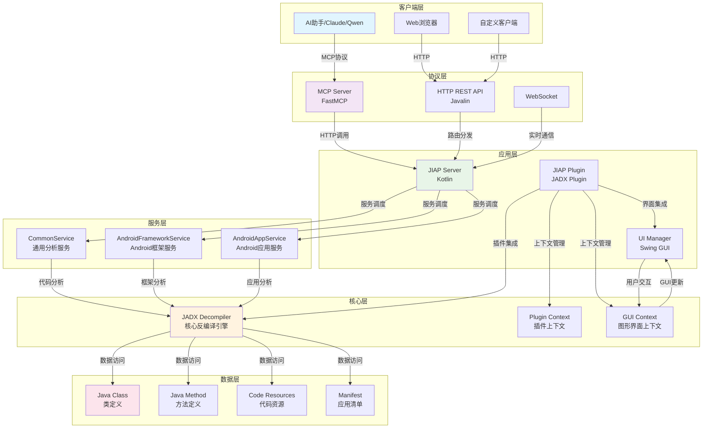

# JIAP - Java智能分析平台

<div align="center">


**基于JADX的Java智能分析平台 - 为AI辅助代码分析而设计**

[📖 文档](#-项目概述) | [🏗️ 架构设计](#-架构设计) | [🚀 快速开始](#-快速开始) | [🛠️ API参考](#-api参考) | [🔧 开发指南](#-开发指南)

</div>

---

## 📖 项目概述

JIAP (Java Intelligence Analysis Platform) 是一个基于JADX反编译器的智能代码分析平台，专门为AI辅助代码分析而设计。该平台通过HTTP API和MCP (Model Context Protocol) 协议，为AI助手提供强大的Java代码分析能力。

### ✨ 核心特性

- 🔍 **智能代码分析**: 基于JADX的深度代码解析和反编译
- 🌐 **HTTP RESTful API**: 提供完整的REST API接口
- 🤖 **MCP协议支持**: 原生支持Model Context Protocol，与AI助手无缝集成
- 📱 **Android专项**: 支持Android应用分析和框架层安全审计
- 🎯 **跨引用分析**: 强大的代码引用关系追踪能力
- 🔄 **实时同步**: 与JADX GUI实时同步，支持选中文本分析
- ⚡ **高性能**: 智能缓存机制，支持大数据量分页处理

### 🎯 应用场景

- **AI辅助代码审计**: 为AI助手提供深度代码分析能力
- **Android安全研究**: 框架层API安全分析和漏洞挖掘
- **恶意软件分析**: Java恶意软件的深度静态分析
- **代码重构优化**: 智能代码结构分析和重构建议
- **学习研究**: Java代码结构学习和教学模式

---

## 🏗️ 架构设计

### 整体架构图



### 技术栈详解

#### 🎨 前端技术
- **Swing GUI**: 基于Java Swing的桌面应用界面
- **JADX GUI**: 集成JADX原生图形界面组件
- **实时同步**: 与JADX GUI的实时状态同步

#### ⚙️ 后端技术
- **Kotlin**: 主要开发语言，类型安全且简洁
- **Javalin**: 轻量级Web框架，提供REST API
- **FastMCP**: MCP协议服务器实现
- **JADX API**: 核心反编译和分析引擎

#### 🗄️ 数据处理
- **智能缓存**: 多级缓存机制，提升响应速度
- **分页处理**: 支持大数据量的分页加载
- **异步处理**: 非阻塞的异步任务处理

### 核心组件设计

#### 1. JIAP Server (HTTP服务器)
```kotlin
class JiapServer(
    private val pluginContext: JadxPluginContext,
    private val scheduler: ScheduledExecutorService
)
```
**职责**:
- HTTP服务器生命周期管理
- API路由配置和请求处理
- 服务健康检查和状态监控
- 延迟初始化和自动重启

#### 2. Service Layer (业务服务层)
```kotlin
interface JiapServiceInterface {
    val pluginContext: JadxPluginContext
    val decompiler get() = pluginContext.decompiler
    val gui: Boolean get() = isGui()
}
```
**设计模式**: 策略模式 + 模板方法模式
**服务分类**:
- **CommonService**: 通用代码分析服务
- **AndroidFrameworkService**: Android框架分析服务
- **AndroidAppService**: Android应用分析服务

#### 3. MCP Server (AI协议层)
```python
class FastMCP("JIAP MCP Server")
```
**核心功能**:
- MCP协议实现
- AI工具集成
- 缓存和分页处理
- 错误处理和重试机制

---

## 🚀 快速开始

### 环境要求

- **Java**: JDK 11+
- **JADX**: 1.5.2 r2472+
- **Python**: 3.8+ (用于MCP Server)
- **内存**: 推荐4GB+

### 安装步骤

#### 1. 编译项目

```bash
# 编译核心插件
cd jiap_core
./gradlew build

# 安装MCP服务器依赖
cd mcp_server
pip install -r requirements.txt
```

#### 2. 安装到JADX

```bash
# 复制插件到JADX插件目录
cp jiap_core/build/libs/jiap-plugin-*.jar ~/.config/jadx/plugins/

# 或者直接在JADX中安装
# JADX -> Plugins -> Install from JAR
```

#### 3. 启动MCP服务器

```bash
cd mcp_server
python jiap_mcp_server.py
```

### 配置说明

#### 端口配置
- **JIAP Server**: 25419 (默认)
- **MCP Server**: 25420 (默认)

#### 环境变量
```bash
export JIAP_SERVER_PORT=25419
export JIAP_MCP_PORT=25420
export JIAP_CACHE_SIZE=10
export JIAP_TIMEOUT=120
```

---

## 🛠️ API参考

### HTTP API端点

#### 基础代码分析
```http
POST /api/jiap/get_all_classes
POST /api/jiap/get_class_source
POST /api/jiap/get_method_source
POST /api/jiap/get_class_info
```

#### 高级分析功能
```http
POST /api/jiap/get_method_xref
POST /api/jiap/get_class_xref
POST /api/jiap/get_implement
POST /api/jiap/get_sub_classes
```

#### Android专项
```http
POST /api/jiap/get_app_manifest
POST /api/jiap/get_main_activity
POST /api/jiap/get_system_service_impl
```

### MCP工具集

#### 基础分析工具
```python
# 获取所有类
get_all_classes(page: int = 1)

# 获取类源码
get_class_source(class_name: str, smali: bool = False, page: int = 1)

# 获取方法源码
get_method_source(method_name: str, smali: bool = False, page: int = 1)

# 获取类信息
get_class_info(class_name: str, page: int = 1)
```

#### 高级分析工具
```python
# 方法交叉引用
get_method_xref(method_name: str, page: int = 1)

# 类交叉引用
get_class_xref(class_name: str, page: int = 1)

# 接口实现类
get_implement(interface_name: str, page: int = 1)

# 子类查找
get_sub_classes(class_name: str, page: int = 1)
```

#### Android专项工具
```python
# 获取应用清单
get_app_manifest(page: int = 1)

# 获取主Activity
get_main_activity(page: int = 1)

# 获取系统服务实现
get_system_service_impl(interface_name: str, page: int = 1)
```

### 请求/响应格式

#### 请求格式
```json
{
  "class": "com.example.MyClass",
  "method": "com.example.MyClass.myMethod(java.lang.String):void",
  "smali": false,
  "interface": "com.example.IMyInterface"
}
```

#### 响应格式
```json
{
  "type": "code|list",
  "name": "com.example.MyClass",
  "code": "源代码内容",
  "methods-list": ["方法列表"],
  "fields-list": ["字段列表"],
  "count": 100,
  "page": 1
}
```

---

## 🔧 开发指南

### 项目结构

```
jiap/
├── jiap_core/                    # 核心插件模块
│   ├── src/main/kotlin/
│   │   └── jadx/plugins/jiap/
│   │       ├── JiapPlugin.kt     # 插件主类
│   │       ├── JiapServer.kt     # HTTP服务器
│   │       ├── model/            # 数据模型
│   │       ├── service/          # 业务服务
│   │       ├── ui/               # UI组件
│   │       └── utils/            # 工具类
│   └── build.gradle.kts         # 构建配置
├── mcp_server/                   # MCP服务器模块
│   ├── jiap_mcp_server.py        # MCP服务器实现
│   └── requirements.txt          # Python依赖
└── README_zh.md                 # 项目文档
```

### 开发环境搭建

#### 1. IDE配置
- **IntelliJ IDEA**: 推荐使用
- **Kotlin Plugin**: 确保Kotlin插件已安装
- **Gradle**: 配置Gradle构建环境

#### 2. 调试配置
```kotlin
// JVM调试参数
-Djiap.debug=true
-Djiap.log.level=DEBUG

// 端口配置
-Djiap.server.port=25419
-Djiap.mcp.port=25420
```

### 扩展开发

#### 1. 新增服务
```kotlin
class CustomService(override val pluginContext: JadxPluginContext) : JiapServiceInterface {

    fun handleCustomAnalysis(): JiapResult {
        // 实现自定义分析逻辑
        return JiapResult(success = true, data = result)
    }
}
```

#### 2. 新增API端点
```kotlin
app.post("/api/jiap/custom_endpoint") { ctx ->
    val result = customService.handleCustomAnalysis()
    handleServiceResult(result, ctx)
}
```

#### 3. 新增MCP工具
```python
@mcp.tool(
    name="custom_analysis",
    description="自定义分析工具"
)
async def custom_analysis(ctx: Context, param: str) -> ToolResult:
    return await request_to_jiap("custom_endpoint", json_data={"param": param})
```

### 性能优化

#### 1. 缓存策略
```kotlin
// 内存缓存
private val cache = ConcurrentHashMap<String, JiapResult>()

// 分页处理
fun getPaginatedResult(data: List<Any>, page: Int, pageSize: Int = 1000): List<Any> {
    return data.drop((page - 1) * pageSize).take(pageSize)
}
```

#### 2. 异步处理
```kotlin
// 异步任务处理
GlobalScope.launch {
    val result = withContext(Dispatchers.IO) {
        // IO密集型操作
        performAnalysis()
    }
    // 处理结果
}
```

### 测试指南

#### 1. 单元测试
```kotlin
@Test
fun testGetClassSource() {
    val service = CommonService(mockContext)
    val result = service.handleGetClassSource("com.example.TestClass", false)
    assertTrue(result.success)
}
```

#### 2. 集成测试
```python
async def test_mcp_server():
    async with ClientSession() as session:
        async with session.post("http://localhost:25420", json={}) as resp:
            assert resp.status == 200
```

---

## 📊 使用示例

### AI辅助代码审计

```python
# 使用MCP工具进行代码分析
tools = [
    "get_class_source",
    "get_method_xref",
    "get_implement"
]

# 分析Android权限检查
result = await get_method_source(
    "com.android.server.PackageManagerService.checkPermission"
)

# 获取交叉引用
xrefs = await get_method_xref(
    "com.android.server.PackageManagerService.checkPermission"
)
```

### Android框架分析

```python
# 分析系统服务实现
service_impl = await get_system_service_impl(
    "android.os.IPowerManager"
)

# 获取主Activity
main_activity = await get_main_activity()

# 分析应用清单
manifest = await get_app_manifest()
```

### 批量代码分析

```python
# 获取所有类
classes = await get_all_classes()

# 分析特定包结构
target_classes = [cls for cls in classes if 'com.example' in cls]

# 批量获取类信息
for class_name in target_classes:
    class_info = await get_class_info(class_name)
    # 分析类信息
```

---

## 🤝 贡献指南

我们欢迎所有形式的贡献！请遵循以下步骤：

### 1. Fork项目
```bash
git clone https://github.com/your-username/jiap.git
cd jiap
```

### 2. 创建分支
```bash
git checkout -b feature/your-feature-name
```

### 3. 提交更改
```bash
git commit -m "Add your feature description"
```

### 4. 推送分支
```bash
git push origin feature/your-feature-name
```

### 5. 创建Pull Request
在GitHub上创建PR，我们将尽快审核。

### 开发规范

- **代码风格**: 遵循Kotlin官方代码规范
- **注释规范**: 使用KDoc进行代码注释
- **测试覆盖**: 新功能需要包含相应的单元测试
- **文档更新**: 更新相关文档和示例

---

## 📄 许可证

本项目采用 [MIT许可证](LICENSE) - 详见 [LICENSE](LICENSE) 文件。

---

## 🙏 致谢

- **[JADX](https://github.com/skylot/jadx)**: 强大的Android反编译器
- **[FastMCP](https://github.com/modelcontextprotocol/servers)**: MCP协议实现
- **[Javalin](https://javalin.io/)**: 轻量级Web框架

---

<div align="center">

**⭐ 如果这个项目对您有帮助，请给我们一个Star！**


</div>