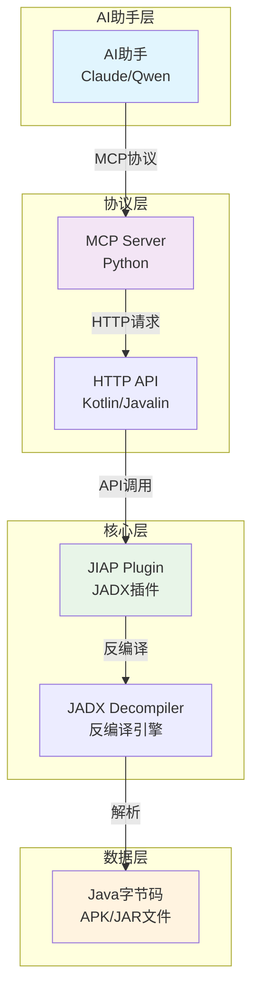

# JIAP - Java智能分析平台

<div align="center">


**基于JADX的Java智能分析平台 - 为AI辅助代码分析而设计**

[📖 文档](#-项目概述) | [🏗️ 架构设计](#-架构设计) | [🚀 快速开始](#-快速开始) | [🛠️ API参考](#-api参考)

</div>

---

## 📖 项目概述

JIAP (Java Intelligence Analysis Platform) 是一个基于JADX反编译器的智能代码分析平台，专门为AI辅助代码分析而设计。该平台通过HTTP API和MCP (Model Context Protocol) 协议，为AI助手提供强大的Java代码分析能力。

---

## 🏗️ 架构设计

### 整体架构图



---

## 🚀 快速开始

### 环境要求

- **Java**: JDK 17+
- **JADX**: 1.5.2 r2472+
- **Python**: 3.8+ (用于MCP Server)
- **内存**: 推荐4GB+

### 快速使用

- `Jadx`中安装`JIAP`插件
- 执行`jiap_mcp_server.py`，使用AI客户端进行代码获取与分析

### 开发

#### 1. 编译项目

```bash
# 编译核心插件
cd jiap_core
./gradlew dist

# 安装MCP服务器依赖
cd mcp_server
uv sync
```

#### 2. 安装到JADX

```bash
jadx plugins --install-jar <path-to-jiap.jar>

# 或者直接在JADX中安装
```

#### 3. 启动方式

##### GUI模式（推荐）

```bash
# 启动JADX GUI，插件自动加载
jadx-gui your-app.apk
```

##### Daemon模式（无GUI后台运行）

```bash
# 使用daemon模式启动，适合服务器环境
jadx -d your-app.apk --export-dir ./output --load-plugins jiap-plugin.jar
```

#### 4. 启动MCP服务器

```bash
cd mcp_server

# 默认配置启动
python jiap_mcp_server.py

# 自定义JADX服务器地址
python jiap_mcp_server.py --jiap-host 192.168.1.100 --jiap-port 25420

# 使用完整URL
python jiap_mcp_server.py --jiap-url "http://192.168.1.100:25420"

# 使用环境变量
export JIAP_URL="http://192.168.1.100:25420"
python jiap_mcp_server.py
```

---

## 🛠️ API参考

### HTTP API端点

```http
POST /api/jiap/get_all_classes          # 获取所有类列表
POST /api/jiap/get_class_source         # 获取类源码
POST /api/jiap/search_method            # 搜索方法
POST /api/jiap/get_method_source        # 获取方法源码
POST /api/jiap/get_class_info           # 获取类信息
POST /api/jiap/get_method_xref          # 方法交叉引用
POST /api/jiap/get_class_xref           # 类交叉引用
POST /api/jiap/get_implement            # 接口实现类
POST /api/jiap/get_sub_classes          # 子类查找
```

#### Android专项
```http
POST /api/jiap/get_app_manifest         # 应用清单
POST /api/jiap/get_main_activity        # 主Activity
POST /api/jiap/get_system_service_impl  # 系统服务实现
```

#### UI集成功能
```http
POST /api/jiap/selected_text            # 获取选中文本
```

### 请求/响应格式

#### 请求格式
```json
{
  "class": "com.example.MyClass",
  "method": "com.example.MyClass.myMethod(java.lang.String):void",
  "smali": false,
  "interface": "com.example.IMyInterface"
}
```

#### 响应格式
```json
{
  "type": "code|list",
  "name": "com.example.MyClass",
  "code": "源代码内容",
  "methods-list": ["方法列表"],
  "fields-list": ["字段列表"],
  "count": 100,
  "page": 1
}
```

---

## 📄 许可证

本项目采用 [GNU许可证](LICENSE) - 详见 [LICENSE](LICENSE) 文件。

---

## 🙏 致谢

- **[JADX](https://github.com/skylot/jadx)**: 强大的Android反编译器
- **[FastMCP](https://github.com/modelcontextprotocol/servers)**: MCP协议实现
- **[Javalin](https://javalin.io/)**: 轻量级Web框架
- **[jadx-ai-mcp](https://github.com/zinja-coder/jadx-ai-mcp/)**：Jadx AI 插件

---

<div align="center">

**⭐ 如果这个项目对您有帮助，请给一个Star！**


</div>